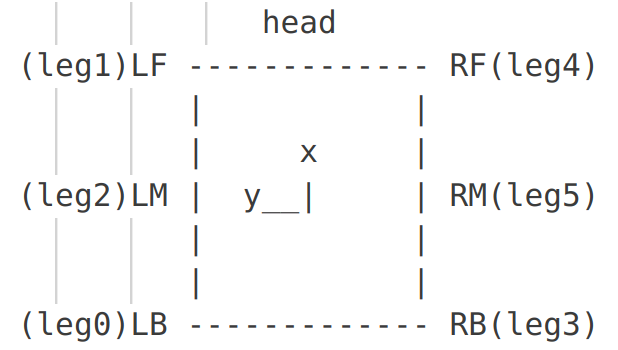

# README.md
#### 默认参数
以程序刚开始运行的时候机器人所在的位置为世界坐标系的原点
机器人的六条腿的ID分配(按照pinocchio读入的顺序来):
LB:0  
LF:1  
LM:2  
RB:3  
RF:4  
RM:5

    

机器人的18个关节的ID分配(按照pinocchio读入的顺序来，可以使用):
=== 关节顺序信息 ===  
模型总关节数: 19  
配置空间维度 (nq): 18  
速度空间维度 (nv): 18  
关节ID: 0, 名称: universe, 父关节: 0  
关节ID: 1, 名称: LB_HAA, 父关节: 0  
关节ID: 2, 名称: LB_HFE, 父关节: 1  
关节ID: 3, 名称: LB_KFE, 父关节: 2  
关节ID: 4, 名称: LF_HAA, 父关节: 0  
关节ID: 5, 名称: LF_HFE, 父关节: 4  
关节ID: 6, 名称: LF_KFE, 父关节: 5  
关节ID: 7, 名称: LM_HAA, 父关节: 0  
关节ID: 8, 名称: LM_HFE, 父关节: 7  
关节ID: 9, 名称: LM_KFE, 父关节: 8  
关节ID: 10, 名称: RB_HAA, 父关节: 0  
关节ID: 11, 名称: RB_HFE, 父关节: 10  
关节ID: 12, 名称: RB_KFE, 父关节: 11  
关节ID: 13, 名称: RF_HAA, 父关节: 0  
关节ID: 14, 名称: RF_HFE, 父关节: 13  
关节ID: 15, 名称: RF_KFE, 父关节: 14  
关节ID: 16, 名称: RM_HAA, 父关节: 0  
关节ID: 17, 名称: RM_HFE, 父关节: 16
关节ID: 18, 名称: RM_KFE, 父关节: 17  

#### 需要的材料

- 机器人的urdf文件(urdf的中性位置需要与底层机器人控制的中性位置保持一致)
- 需要能够获得机器人的所有电机的关节角度位置向量$q$(18*1 Vector)
- 需要能够获得机器人的所有腿的触地状态(6*1 Vector)
- (optional)机器人当前运行的步态是几步态
- 如果不是完全平坦地面的话，需要IMU信息得到机器人的三个姿态角pitch, roll, yaw

#### 做出的假设
- 机器人的支撑相的足端没有滑移
- 可以忽略每一个步态相位最后一点时间没有拿到机器人的编码器的短暂时间

#### variables
1. `ROBOT_STATE`:`BEFORE_INIT`, `FREE_STAND`, `SIX_GAIT`, `THREE_GAIT`, `TWO_GAIT`, `UNKNOWN_GAIT`
2. `PHASE_START_GLOBAL_HOMO_TRANS`:
3. `PHASE_CUR_GLOBAL_HOMO_TRANS`:
4. `PHASE_START_STANCE_LEGS_ID_SET`(set<int>): 这个步态周期开始的时候处于着地状态的腿的id的set
5. `PHASE_START_STANCE_LEGS_ID_NUM`(int): 这个步态周期开始的时候处于着地状态的腿的数量
6. `PHASE_START_LOCAL_HOMO_TRANS_MAP`(map<int(腿id), 齐次变换矩阵>)
7. `PHASE_CUR_LOCAL_HOMO_TRANS_MAP`(map<int(腿id), 齐次变换矩阵>)
8. `CUR_STANCE_LEGS_ID_SET`(set<int> 现在处于着地状态的腿的id的set)
9. `CUR_STANCE_LEGS_ID_NUM`(int 现在处于着地状态的腿的数量)

#### 基本原理
1. 初始化:
   1. 初始化现在的位置为世界坐标系原点位置，状态为`BEFORE_INIT`
   2. 判断现在有几个腿着地，记录着地腿的id和着地腿的数量分别到`PHASE_START_STANCE_LEGS_ID_SET`和`PHASE_START_STANCE_LEGS_ID_NUM`
      1. 如果有六个腿着地的话，初始化状态为`FREE_STAND`，运行正运动学，记录此时所有着地足端相对于机身base_link的齐次变换矩阵到`PHASE_START_LOCAL_HOMO_TRANS_MAP`
      2. 如果有五个腿着地的话，初始化状态为`SIX_GAIT`，运行正运动学，记录此时所有着地足端相对于机身base_link的齐次变换矩阵到`PHASE_START_LOCAL_HOMO_TRANS_MAP`
      3. 如果有四个腿着地的话，初始化状态为`THREE_GAIT`，运行正运动学，记录此时所有着地足端相对于机身base_link的齐次变换矩阵到`PHASE_START_LOCAL_HOMO_TRANS_MAP`
      4. 如果有三个腿着地的话，初始化状态为`TWO_GAIT`，运行正运动学，记录此时所有着地足端相对于机身base_link的齐次变换矩阵到`PHASE_START_LOCAL_HOMO_TRANS_MAP`
      5. 如果有少于三个腿着地的话，初始化状态为`UNKNOWN_GAIT`，throw_error()，状态变换到`BEFORE_INIT`
   
2. 状态已经不是`BEFORE_INIT`了，记录着地腿的id和着地腿的数量分别到`CUR_STANCE_LEGS_ID_SET`和`CUR_STANCE_LEGS_ID_NUM`，判断`CUR_STANCE_LEGS_ID_SET`与`PHASE_START_STANCE_LEGS_ID_SET`是否一致:
   1. 如果一致的话，说明处于同一个步态周期内，运行正运动学，记录此时所有着地足端相对于机身base_link的齐次变换矩阵到`PHASE_CUR_LOCAL_HOMO_TRANS_MAP`，求出`diff` = `PHASE_CUR_LOCAL_HOMO_TRANS_MAP`-`PHASE_START_LOCAL_HOMO_TRANS_MAP`，更新`PHASE_CUR_GLOBAL_HOMO_TRANS` = `PHASE_START_GLOBAL_HOMO_TRANS` + `diff`，采用ros tf发布现在的状态
   2. 如果不一致的话，说明已经处于新的步态周期了，那么要做如下的事情：
      1. `PHASE_START_GLOBAL_HOMO_TRANS` = `PHASE_CUR_GLOBAL_HOMO_TRANS`
      2. 判断现在有几个腿着地，记录着地腿的id和着地腿的数量分别到`PHASE_START_STANCE_LEGS_ID_SET`和`PHASE_START_STANCE_LEGS_ID_NUM`
         1. 如果有六个腿着地的话，初始化状态为`FREE_STAND`，运行正运动学，记录此时所有着地足端相对于机身base_link的齐次变换矩阵到`PHASE_START_LOCAL_HOMO_TRANS_MAP`
         2. 如果有五个腿着地的话，初始化状态为`SIX_GAIT`，运行正运动学，记录此时所有着地足端相对于机身base_link的齐次变换矩阵到`PHASE_START_LOCAL_HOMO_TRANS_MAP`
         3. 如果有四个腿着地的话，初始化状态为`THREE_GAIT`，运行正运动学，记录此时所有着地足端相对于机身base_link的齐次变换矩阵到`PHASE_START_LOCAL_HOMO_TRANS_MAP`
         4. 如果有三个腿着地的话，初始化状态为`TWO_GAIT`，运行正运动学，记录此时所有着地足端相对于机身base_link的齐次变换矩阵到`PHASE_START_LOCAL_HOMO_TRANS_MAP`
         5. 如果有少于三个腿着地的话，初始化状态为`UNKNOWN_GAIT`，throw_error()，状态变换到`BEFORE_INIT`
